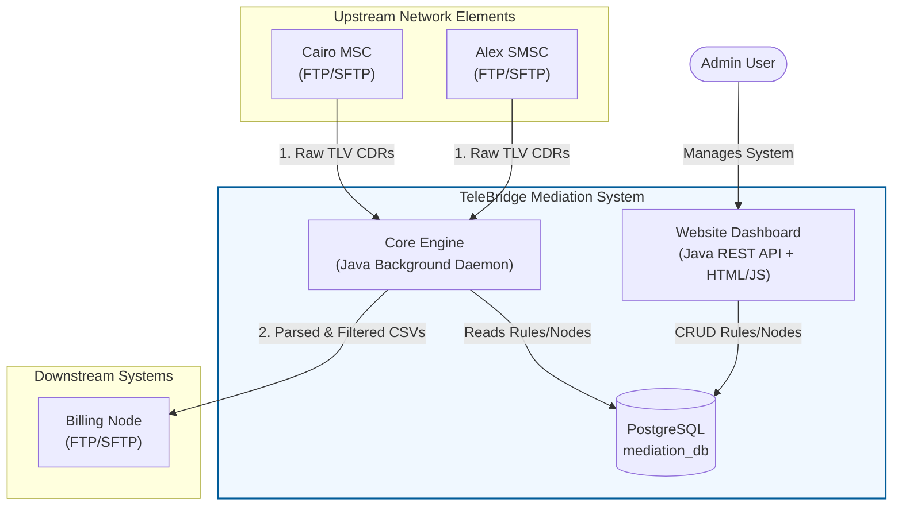

# TeleBridge Mediation System

A scalable, containerized Java middleware bridging upstream network elements (MSCs/SMSCs) and downstream billing systems. It automates the multi-protocol collection (FTP/SFTP), ASN.1/TLV decoding, filtration, and CSV distribution of Call Detail Records (CDRs) using Clean Architecture, PostgreSQL, and Docker. 

It also features a **Web Dashboard** for administrators to manage network nodes, define mediation rules, and monitor system activity in real-time.

## Architecture



## System Components & Pipeline

The system is split into two primary applications running in tandem:

### 1. Website Dashboard
The administration portal where users can:
- **Manage Nodes**: Register Upstream (source) and Downstream (destination) network elements.
- **Manage Rules**: Define Mediation Rules connecting sources to destinations with specific filters (Zero-duration, Emergency).
- **Monitor Activity**: View real-time system logs and metrics (e.g., CDRs processed today).

### 2. Core Engine Pipeline
The backend daemon runs continuously (every 15 seconds) executing this pipeline:
1. **Fetch Config**: Reads network topology & mediation rules from PostgreSQL.
2. **Provision Containers**: Automatically spins up Docker containers for any new FTP/SFTP nodes defined in the dashboard.
3. **Download**: Fetches CDR files from upstream nodes (`FtpClient`, `SftpClient`).
4. **Parse**: Decodes binary Hex TLV-encoded CDR files into Java objects (`TlvParser`).
5. **Mediation**: Deduplicates records and applies configured filters (e.g., drops zero-duration voice calls) (`MediationProcessor`).
6. **Export & Upload**: Converts processed CDRs to CSV format and uploads them to downstream billing nodes (`CdrExporter`).
7. **Archive**: Archives the original raw files to prevent reprocessing (`FileArchiver`).

## Prerequisites

- **Docker** & **Docker Compose** (v2+)
- That's it! Everything (PostgreSQL, Java Engine, Tomcat Web Server, Simulated Nodes) runs seamlessly in Docker.

## Quick Start

```bash
# 1. Clone the repository
git clone https://github.com/Medhat31/TeleBridge-Mediation-System.git
cd TeleBridge-Mediation-System

# 2. Set the host project root (required for Docker volume mounts)
echo "HOST_PROJECT_ROOT=$(pwd)" >> .env

# 3. Start everything with a single command
docker compose up --build

# 4. View logs
docker compose logs -f

# 5. Stop everything
docker compose down
```

### Accessing the Dashboard
Once the containers are up, open your browser to:
- **URL**: `http://localhost:8080`
- **Email**: `admin@telebridge.com`
- **Password**: `admin123`

> **Note on Security:** These default credentials are included in the initial database seed script (`init-db.sql`) purely for local testing and demonstration purposes. They must be changed before deploying to any production environment.

## Project Structure

```
TeleBridge-Mediation-System/
├── core/                          # Java Mediation Engine (Daemon)
│   ├── src/main/java/com/mediation/core/
│   │   ├── Core.java              # Entry point pipeline loop
│   │   ├── MediationProcessor.java# CDR filtering logic
│   │   ├── entities/              # Data models (Cdr, Node, MediationRule)
│   │   ├── orchestration/         # Docker lifecycle & Archiving
│   │   ├── parsing/               # Hex TLV binary decoder
│   │   ├── repository/            # PostgreSQL queries
│   │   └── transfer/              # FTP/SFTP clients & CSV Export
│   └── pom.xml
│
├── website/                       # Java Web App & REST API (Dashboard)
│   ├── src/main/java/com/mediation/website/
│   │   ├── entity/                # Web models & DTOs
│   │   ├── repository/            # Database access
│   │   ├── service/               # Business logic & Auth
│   │   └── resources/             # JAX-RS API Controllers
│   ├── src/main/webapp/           # Frontend (HTML, CSS, JS)
│   │   ├── css/                   # Stylesheets
│   │   ├── js/                    # API wrappers & UI logic
│   │   └── *.html                 # Dashboard views
│   └── pom.xml
│
├── scripts/                       # Python Simulator
│   └── cdr-generator.py           # Auto-generates CDRs on upstream nodes
│
├── database/                      # PostgreSQL Init Scripts
│   └── init-db.sql                # Schema & default admin user
│
├── engine_workspace/              # Local engine processing directories
├── node_volumes/                  # Local FTP/SFTP container volumes
├── docker-compose.yml             # Orchestration for all services
└── .env                           # Environment variables
```

## Configuration

### Environment Variables (`.env`)

You can change the database configuration (username, password, database name) by creating or modifying the `.env` file in the project root. Both the PostgreSQL database and the applications automatically use these variables to configure their connections.

**Example `.env` format:**
```env
# PostgreSQL Container Initialization
POSTGRES_USER=telecom_user
POSTGRES_PASSWORD=1234
POSTGRES_DB=mediation_db

# Application Connection Settings (used by Java engine and Python scripts)
DB_HOST=mediation-db
DB_PORT=5432
DB_NAME=mediation_db
DB_USER=telecom_user
DB_PASSWORD=1234

# Required Mount Path
HOST_PROJECT_ROOT=/absolute/path/to/TeleBridge-Mediation-System
```

| Variable | Default | Description |
|----------|---------|-------------|
| `POSTGRES_USER` | `telecom_user` | PostgreSQL username |
| `POSTGRES_PASSWORD` | `1234` | PostgreSQL password |
| `POSTGRES_DB` | `mediation_db` | PostgreSQL database name |
| `DB_HOST` | `mediation-db` | Database hostname (Docker service name) |
| `DB_PORT` | `5432` | Database port |
| `HOST_PROJECT_ROOT` | `.` | **Required**: Absolute path to project root on host |

### Engine Configuration (`core/src/main/resources/app.properties`)

| Property | Default | Description |
|----------|---------|-------------|
| `engine.poll.interval.seconds` | `15` | Pipeline cycle interval |
| `mediation.emergency.numbers` | `112,122,123,180` | Comma-separated emergency numbers to filter |
| `docker.network` | `telebridge-mediation-system_telecom-net` | Docker network for provisioned containers |
| `security.ssh.strict.host.checking` | `no` | SSH host key verification |

All properties can be overridden via environment variables (dots → underscores, uppercased).

## CDR Data Format

The upstream nodes generate files using a custom **Hex TLV (Tag-Length-Value)** binary encoding:

| Tag | Field | Type | Size |
|-----|-------|------|------|
| `01` | Record ID | Integer | 4 bytes |
| `02` | Record Type | Integer | 1 byte (0=Voice, 1=SMS) |
| `03` | Dial A (Caller) | ASCII String | Variable |
| `04` | Dial B (Called) | ASCII String | Variable |
| `05` | Answer Time | ASCII String | 14 bytes (YYYYMMDDHHMMSS) |
| `06` | Quantity | Integer | 4 bytes (seconds or SMS count) |
| `07` | Cause for Termination | Integer | 1 byte (16=Normal) |
| `08` | Call Direction | Integer | 1 byte (0=MO, 1=MT) |

All records are wrapped in a master tag `A0` with a length prefix.

## CSV Output Format

The engine translates the TLV files into clean, human-readable CSVs for the billing systems:

```csv
Type,Direction,A_Party,B_Party,Time,Duration,Cause
VOICE,MO,20101234567,20119876543,20260706120000,300,16
SMS,MT,20105551234,20118887654,20260706130000,1,16
```

## Mediation Rules

The engine applies these filters (configurable per routing rule in the database):

1. **Deduplication** — Removes records with identical A-party + B-party + timestamp
2. **Zero Duration Filter** — Drops voice calls with 0-second duration
3. **Emergency Number Filter** — Drops calls to emergency numbers (112, 122, 123, 180)

## Testing

Both the Core Engine and Website feature comprehensive unit testing:

```bash
# Run Core Engine tests
cd core && mvn test

# Run Website tests (if applicable)
cd website && mvn test
```

## Team Members

This project was built by:
- **Sief Abdelsalam**
- **Medhat Osama**
