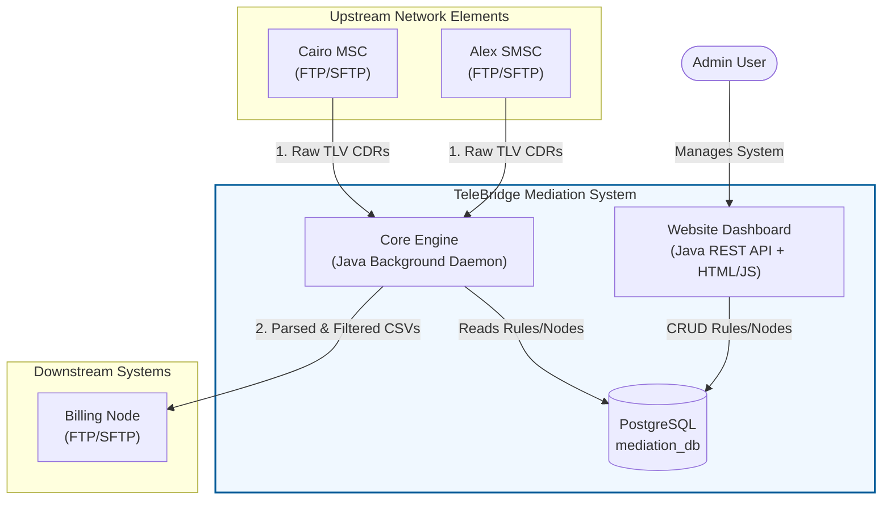
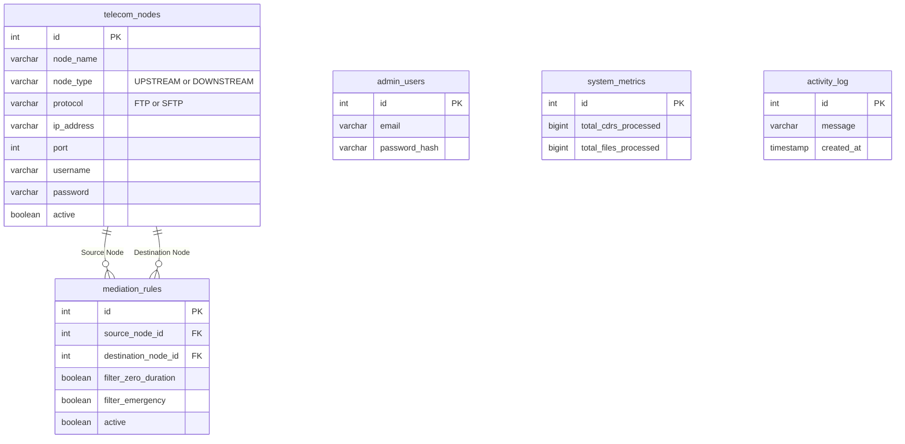
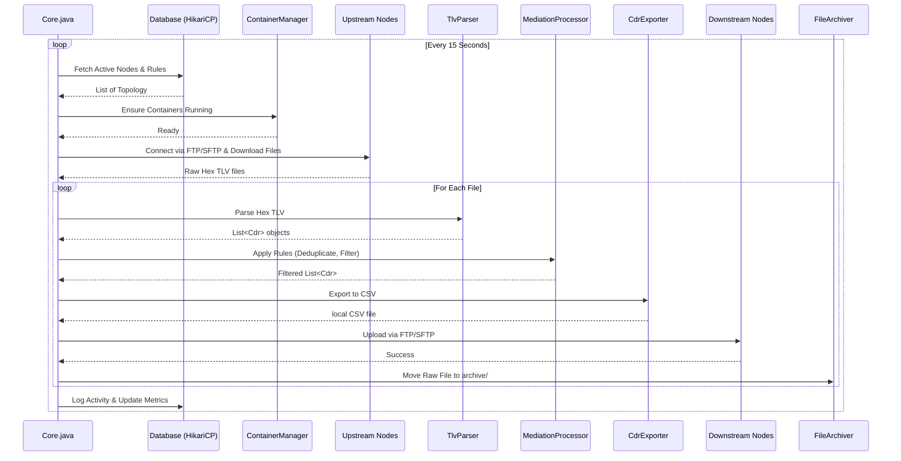
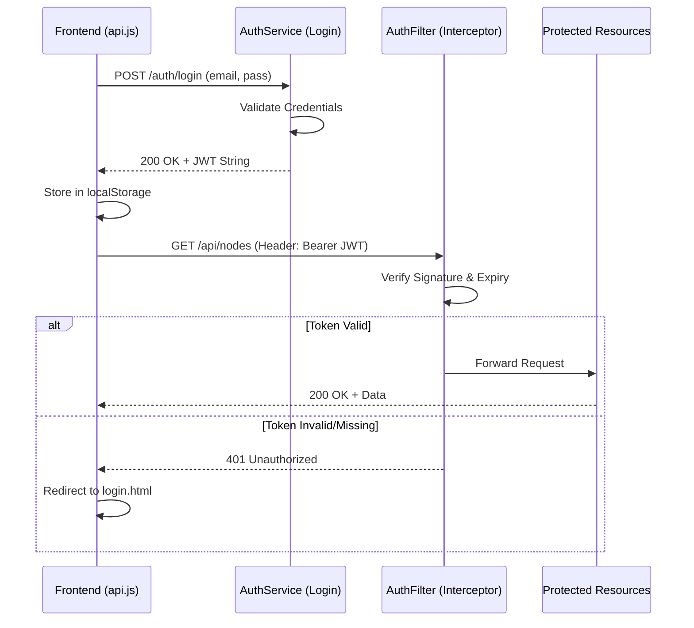

# TeleBridge Mediation System: Complete Technical Documentation

## Abstract
The **TeleBridge Mediation System** is a sophisticated, containerized middleware application built in Java. Its primary function is to act as a bridge between upstream network elements (like MSCs and SMSCs) and downstream systems (like Billing and Analytics engines). It downloads raw, binary-encoded Call Detail Records (CDRs), parses them, applies mediation rules (filtering and deduplication), translates them into human-readable CSVs, and uploads them to the downstream systems.

Additionally, the system features a **Java REST API and Web Dashboard** to manage the network topology, configure mediation rules, and monitor system health.

---

## 1. Telecommunications Primer

To understand the system, one must understand the domain:
- **MSC (Mobile Switching Center)**: The core node in a cellular network that routes voice calls and SMS.
- **SMSC (Short Message Service Center)**: The node responsible for storing and forwarding text messages.
- **CDR (Call Detail Record)**: A digital paper trail generated by an MSC/SMSC for every transaction. It contains the Caller ID, Receiver ID, Duration, Timestamp, and Call Direction.
- **Mediation**: The process of collecting, formatting, filtering, and distributing CDRs so that billing systems can process them without dealing with raw network formats.
- **TLV (Tag-Length-Value)**: A binary encoding format used to compress CDRs. Instead of JSON or XML, data is represented as a Tag (what the data is), Length (how big it is), and Value (the actual data). TeleBridge processes a custom Hex-encoded TLV format.

---

## 2. Global Architecture & Orchestration

The system is fully containerized using **Docker Compose**. It consists of several interconnected services:
1. **PostgreSQL (`mediation-db`)**: The central database.
2. **Python Simulator (`cdr-generator`)**: A Python script that automatically generates fake TLV-encoded CDRs every 15 seconds and places them into upstream node volumes.
3. **Core Engine (`mediation-engine`)**: A headless Java daemon running the processing loop.
4. **Website Dashboard (`mediation-website`)**: A Tomcat-based Java web application serving the REST API and the HTML/JS frontend.

### 2.1 System Architecture Diagram

### 2.2 Volumes and Networking
- **`engine_workspace`**: A local directory mounted into the Core Engine containing `input/`, `output/`, and `archive/` folders for processing files locally.
- **`node_volumes`**: A local directory containing subfolders for each dynamically created upstream/downstream node (e.g., `UPSTREAM/Cairo_MSC_01`).
- **Network (`telecom-net`)**: All containers are bridged on this custom Docker network, allowing them to resolve each other by container name (e.g., the engine connects to `ftp-Cairo_MSC_01`).

---

## 3. Database Schema (`init-db.sql`)

The database (`mediation_db`) is initialized with five core tables.

### 3.1 Entity-Relationship Diagram

### 3.2 Table Breakdown
1. **`telecom_nodes`**: Stores upstream (source) and downstream (destination) elements.
2. **`mediation_rules`**: Defines the routing and filtering logic. It links a `source_node_id` to a `destination_node_id`.
3. **`admin_users`**: Stores administrators who can log into the dashboard.
4. **`system_metrics`**: A single-row table tracking lifetime system statistics.
5. **`activity_log`**: An audit trail of system events.

---

## 4. The Core Engine (Java Daemon)

The `core` module is a standalone Java application. It uses Maven, JDBC, and JSch, but relies on no heavy frameworks like Spring.

### 4.1 Orchestration Loop (`Core.java`)
The application entry point. It runs an infinite `while(true)` loop (governed by `AppConfig.engine.poll.interval.seconds`). 

### 4.2 Database Connection (`DBConnection.java`)
**Implementation Trick:** We use **HikariCP**, a lightning-fast JDBC connection pool. Because the engine polls every 15 seconds, opening and closing raw JDBC connections would bottleneck the system. HikariCP keeps a persistent pool of connections to PostgreSQL, yielding sub-millisecond query times.

### 4.3 Container Management (`ContainerManager.java`)
**Implementation Trick:** When an admin adds a new node in the UI, the Java engine dynamically spins up a real Docker container (vsftpd or atmoz/sftp) to simulate that node. 
- It uses Java's `ProcessBuilder` to execute `docker run`.
- **The Challenge:** To mount volumes dynamically, the container path must match the host machine's absolute path. We solved this by injecting `HOST_PROJECT_ROOT` into the `.env` file. `ContainerManager` reads this variable to construct the precise `-v` bind mount string.

### 4.4 File Transfer (`TransferClient`, `FtpClient.java`, `SftpClient.java`)
A Factory Pattern (`TransferFactory`) instantiates either an FTP or SFTP client based on the database configuration.
- **`FtpClient.java`**: Uses Apache Commons Net.
- **`SftpClient.java`**: Uses JSch. 
- **Implementation Trick:** SSH connections usually require the user to accept the host's RSA fingerprint. In an automated Docker environment, this blocks execution. We bypass this by injecting `StrictHostKeyChecking=no` into the JSch session properties, allowing silent, automated SFTP connections.

### 4.5 Binary TLV Parsing (`TlvParser.java`)
The most complex algorithmic file in the system. It reads custom Hex strings.
- **Master Tag `A0`**: Entire files are wrapped in an `A0` tag. The parser recursively unwraps this.
- It slices the string by calculating the Length byte, extracting the Value, and mapping the Tags (`01` = Record ID, `02` = Record Type, `03` = Caller, etc.) to the `Cdr.java` entity object.

### 4.6 Mediation Logic (`MediationProcessor.java`)
Processes a list of `Cdr` objects based on a `MediationRule`.
- **Deduplication**: We use a Java `HashSet`. If a CDR has the exact same Caller, Receiver, and Timestamp as another, it is rejected.
- **Zero Duration**: Drops voice calls (`type == 0`) with `duration == 0`.
- **Emergency Filter**: Drops calls where the Receiver is in the `app.properties` emergency list (e.g., 112, 122).

### 4.7 Export & Archive (`CdrExporter.java`, `FileArchiver.java`)
- `CdrExporter`: Converts the mediated `Cdr` objects into a comma-separated format, translating enums (e.g., `0` -> `VOICE`, `16` -> `Normal Termination`).
- `FileArchiver`: Moves the original raw TLV file into the `archive/` directory and appends a timestamp to prevent the engine from processing it again on the next loop.

---

## 5. Website Dashboard (Java Web App)

The `website` module is deployed to an Apache Tomcat server. It uses JAX-RS (Jersey) for the REST APIs.

### 5.1 Security: Stateless JWT (`AuthFilter.java`, `AuthService.java`)
**Implementation Trick:** Containerized environments struggle with stateful HTTP sessions (like `HttpSession`). We implemented JSON Web Tokens (JWT).

- When an admin logs in, `AuthService` generates a signed JWT string.
- `AuthFilter` implements `ContainerRequestFilter`. It intercepts *every* incoming API request (except `/auth/login`).
- It extracts the `Authorization: Bearer <token>` header, verifies the signature, and rejects the request (`401 Unauthorized`) if the token is invalid or missing.

### 5.2 API Resources (JAX-RS)
- **`NodeResource.java` & `RuleResource.java`**: Standard CRUD controllers. They accept JSON payloads, map them to Java Entities, and call the Services.
- **`MetricsResource.java`**: Fetches total CDR counts and aggregates for the dashboard cards.
- **`ActivityResource.java`**: Fetches the recent system logs generated by the Core Engine.

### 5.3 Services Layer
- `NodeService.java` and `RuleService.java` handle the business logic before executing JDBC queries. 
- For example, when a Node is deactivated, `NodeService` also executes logic to pause it or log the state change in the `activity_log`.

---

## 6. Frontend Dashboard (HTML / CSS / JavaScript)

The frontend is a Single Page Application (SPA)-style interface built without heavy frameworks (Vanilla JS, Vanilla CSS) for maximum performance.

### 6.1 Authentication Wrapper (`api.js`)
**Implementation Trick:** Instead of writing `fetch()` with headers in every file, `api.js` exposes an `apiFetch(endpoint, options)` function. It automatically retrieves the JWT from `localStorage` and injects it. If the token is missing, it automatically redirects the user back to `login.html`.

### 6.2 Data Hydration (`dashboard.js`, `nodes.js`, `rules.js`)
- **`dashboard.js`**: Uses `Promise.all()` to concurrently fetch Nodes, Rules, and Metrics. This prevents sequential blocking and ensures the dashboard renders instantly. It populates the statistical cards and the Activity Feed.
- **`nodes.js`**: Fetches the list of network elements, renders an HTML table, and attaches event listeners to "Edit", "Delete", and "Toggle Status" buttons. It handles the pop-up modal for creating new nodes.
- **`rules.js`**: Similar to nodes, but it must fetch the nodes first to populate the "Source" and "Destination" dropdowns in the creation modal.

### 6.3 UI Utilities (`ui.js`)
Provides elegant, non-blocking user feedback.
- **`showToast(message, type)`**: Creates a temporary, animated notification banner (Success/Error/Warning) that slides in from the top and disappears after 3 seconds.
- **`showConfirmModal()`**: A custom confirmation dialog used before destructive actions (like deleting a node), replacing the ugly default browser `confirm()` prompt.

---

## 7. Development & Testing Workflow

### 7.1 Local Development
Developers can test the engine locally by commenting out the Docker components in `Core.java` and manually placing Hex strings into the `engine_workspace/input/` directory.

### 7.2 Maven Build Process
Both projects are built with Maven:
- **Core Engine (`pom.xml`)**: Uses the `maven-shade-plugin` to build a "fat jar" (Uber JAR) that includes all dependencies (PostgreSQL driver, HikariCP, JSch). This allows the daemon to be run easily via `java -jar core-1.0-SNAPSHOT-shaded.jar`.
- **Website (`pom.xml`)**: Uses the `maven-war-plugin` to package the REST API and the frontend assets into a `.war` file, which is automatically deployed to the Tomcat server in the `docker-compose.yml`.

### 7.3 Unit Testing
JUnit 5 is used to ensure system integrity:
- `TlvParserTest.java`: Tests valid hex strings, invalid data types, and boundary conditions.
- `MediationProcessorTest.java`: Tests that duplicate records are caught and that emergency/zero-duration calls are successfully dropped based on the provided configuration rules.

---

## 8. API Documentation (Javadoc & JSDoc)

To maintain a clean and highly readable architecture, the literal code-level documentation is continuously generated into beautifully formatted HTML sites. 

You can find the comprehensive documentation for every class, function, and variable by opening the following files in your web browser:

### 8.1 Core Engine (Java)
- **Path**: `core/target/reports/apidocs/index.html`
- **Contains**: Detailed parameter and return-type documentation for `TlvParser`, `MediationProcessor`, `TransferClient`, etc.

### 8.2 Website Backend (Java)
- **Path**: `website/target/reports/apidocs/index.html`
- **Contains**: JAX-RS endpoint specifications, Database Repositories, and Services layer documentation.

### 8.3 Website Frontend (JavaScript)
- **Path**: `docs/jsdoc/index.html`
- **Contains**: JSDoc definitions for frontend HTTP wrappers, asynchronous DOM hydration, and modal logic.
